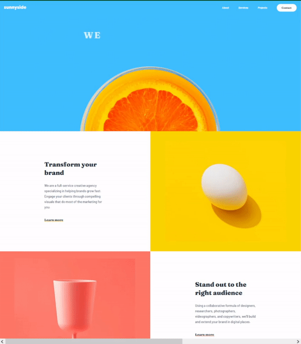
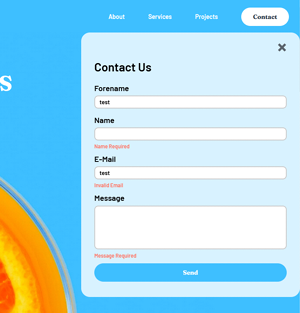
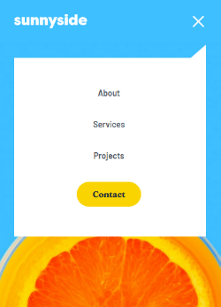
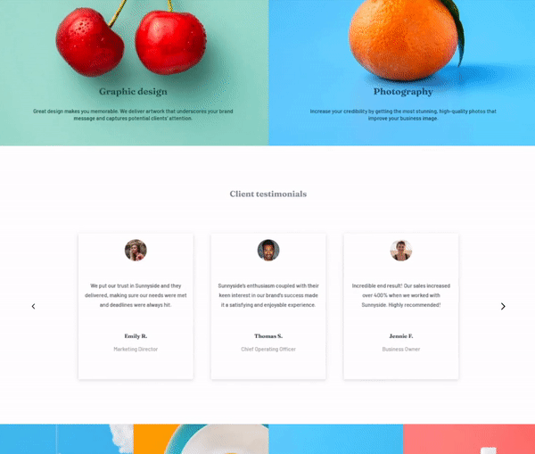

# Frontend Mentor - Sunnyside agency landing page solution

This is a solution to the [Sunnyside agency landing page challenge on Frontend Mentor](https://www.frontendmentor.io/challenges/sunnyside-agency-landing-page-7yVs3B6ef).

## Table of contents

- [Overview](#overview)
  - [The challenge](#the-challenge)
  - [Screenshot](#screenshot)
- [My process](#my-process)
  - [Built with](#built-with)
  - [What I learned](#what-i-learned)

## Overview

### The challenge

Users should be able to:

- View the optimal layout for the site depending on their device's screen size
- See hover states for all interactive elements on the page

### Screenshot
- Desktop: 
  
- Contact form and mobile menu: 

  
- Carousell: 

## My process

### Built with

- Semantic HTML5 markup
- SCSS
- CSS custom properties
- Flexbox
- CSS Grid
- [Vue.js](https://vuejs.org/) - JavaScript framework
- [Webpack](https://webpack.js.org/) - Module bundler
- [ESLint](https://eslint.org/)

### What I learned

I started this challenge at the beginning of the year in order to learn how to layout a website using CSS/SCSS. 
..no, it didn't take 11 months to finish it. :wink: I'm just sharing it now as I was occupied with other projects.  
While solving the challenge it was important to me to understand the concept and benefits of Flexbox and CSS Grid 
as well as making the website work on different devices (moblile, desktop and everything in between). 
I also made myself familiar with CSS transitions and animations to enhance the user experience of the website.  
But I ended up trying out more techniques e.g. Webpack, ESLint and building components 
like a carousell or a contact form with a basic form validation, which I could use for my personal website.
